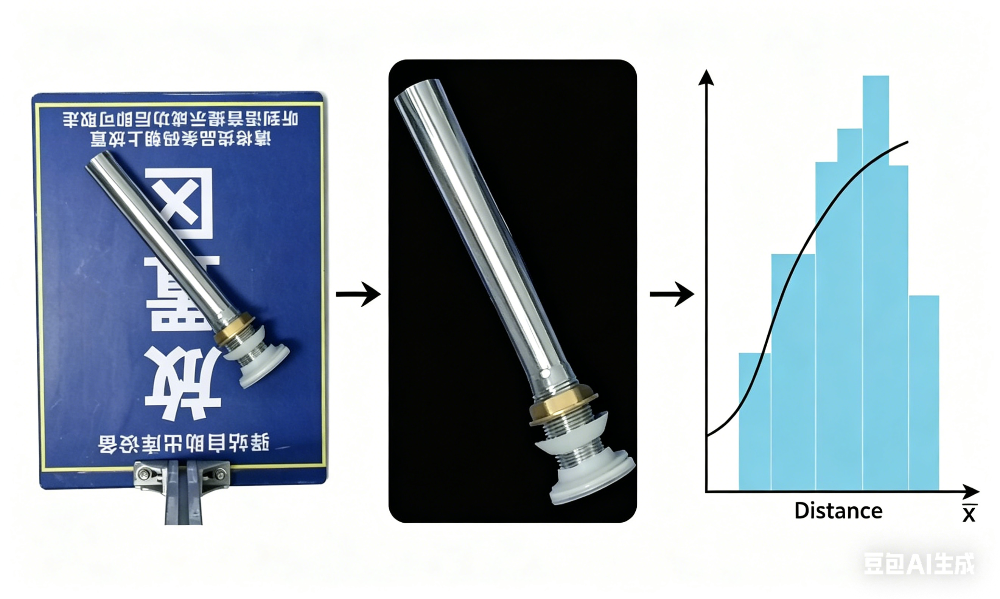

```{r setup, message = F, include=FALSE}
Sys.setenv(FONTCONFIG_PATH = "C:/Users/admin/AppData/Roaming/TinyTeX/tlpkg/tlpostcode/xetex/conf")
options(htmltools.dir.version = FALSE)
knitr::opts_chunk$set(dev = "cairo_pdf")
library(ggplot2)
library(ks)
library(patchwork)
library(dplyr)
set.seed(42)
knitr::opts_chunk$set(
  dev = "cairo_pdf",
  comment = "",        # 全局去掉 ## 前缀
  collapse = TRUE,     # 全局合并代码和输出框
  message = FALSE,     # 全局屏蔽包加载信息
  warning = FALSE,     # 全局屏蔽警告
  fig.align = "center" # 全局让所有图片居中
)
```


*I used Python first for simplicity and transformed the code to R with the help of AI. But the plots in Rmd are a bit ugly. 😞*

### 1. About Data

- The dataset originates from 3 photos of hospital **drainage devices** against specific backgrounds.
- Using visual priors and a BackgroundMattingV2 model, the devices were extracted from their backgrounds. 
- Following data augmentation, a ConvNeXt-Tiny model embedded the images into 648 **768-dimensional feature vectors**. 
- Finally, I calculated the 1-nearest neighbor distance for each vector and smoothed the resulting distribution using KDE, treating it as the **true population distribution**.



```{r load-data}
# 导入数据
df <- read.csv('features.csv')
features <- as.matrix(df)
cat(sprintf("特征矩阵形状: %d x %d\n", nrow(features), ncol(features)))
```

```{r normalize}
normalize_l2 <- function(features) {
  # L2 归一化
  norm <- sqrt(rowSums(features^2))
  features / (norm + 1e-10)
}
features <- normalize_l2(features)
```

```{r distances}
distances <- function(features) {
  # 计算每个样本与其最近邻的距离
  n <- nrow(features)
  sim_matrix <- features %*% t(features)  # 余弦相似度矩阵
  dist_matrix <- 1 - sim_matrix
  diag(dist_matrix) <- Inf
  dist_matrix <- pmax(dist_matrix, 0)
  dists <- apply(dist_matrix, 1, function(row) {
    idx <- order(row)[1]
    row[idx]
  })
  dists
}
dists <- distances(features) # 距离
cat("最长距离:", max(dists), "\n")
cat("最短距离:", min(dists), "\n")
```

```{r}
kde <- ks::kde(dists)
get_samples <- function(kde, n1, num_samples) {
  # 从population中采样
  lapply(seq_len(num_samples), function(it) {
    set.seed((it + 6)^3)
    ks::rkde(n1, kde)
  })
}
kde_resample <- function(kde, n, seed = NULL) {
  if (!is.null(seed)) set.seed(seed)
  ks::rkde(n, kde)
}
```

```{r plot-all-function}
plot_all <- function(dists, kde, true_val, true_samples,
                     n1, B, colors,
                     true_label = 'M', sample_label = 'm',
                     fn = median) {
  # 绘制讲义中的三列图
  num_samples <- length(true_samples)
  all_samples <- matrix(kde_resample(kde, n1 * B, seed = 1), nrow = n1, ncol = B)
  sampling_stats <- apply(all_samples, 2, fn)
  bootstrap_stats <- vector("list", num_samples)
  smooth_stats    <- vector("list", num_samples)

  for (i in seq_len(num_samples)) {
    sample_i <- true_samples[[i]]
    boot_samples <- matrix(
      sample(sample_i, size = n1 * B, replace = TRUE),
      nrow = n1, ncol = B
    )
    boot_stat_vec <- apply(boot_samples, 2, fn)
    bootstrap_stats[[i]] <- boot_stat_vec

    s <- sd(sample_i)
    h <- s / sqrt(n1)  # kernel sd
    noise <- matrix(rnorm(n1 * B, mean = 0, sd = h), nrow = n1, ncol = B)
    smooth_boot_stat_vec <- apply(boot_samples + noise, 2, fn)
    smooth_stats[[i]] <- smooth_boot_stat_vec
  }

  clean_theme <- theme(
    axis.ticks.y   = element_blank(),
    axis.text.y    = element_blank(),
    axis.title.y   = element_blank(),
    panel.grid     = element_blank(),
    panel.background = element_blank(),
    axis.line.x    = element_line(color = "black"),
    plot.margin    = margin(5, 5, 30, 5)
  )

  plots <- list()

  # population + samples
  p_pop <- ggplot(data.frame(x = dists), aes(x = x)) +
    geom_density(color = "black", linewidth = 0.4) +
    geom_vline(xintercept = true_val, linetype = "solid", linewidth = 0.4) +
    labs(title = "Population", x = NULL) +
    annotate("text", x = true_val, y = -Inf,
             label = true_label,
             hjust = 0.5, vjust = 2.5, size = 3.5) +
    coord_cartesian(clip = "off") +
    clean_theme
  plots[["col1_row0"]] <- p_pop

  for (i in seq_len(num_samples)) {
    sample_i  <- true_samples[[i]]
    samp_stat <- fn(sample_i)
    p <- ggplot(data.frame(x = sample_i), aes(x = x)) +
      geom_histogram(bins = 15, fill = colors[i], alpha = 0.7) +
      geom_vline(xintercept = true_val, linetype = "solid", linewidth = 0.4) +
      geom_vline(xintercept = samp_stat, linetype = "dashed", linewidth = 0.5) +
      labs(title = paste0("Sample ", i), x = NULL) +
      annotate("text", x = samp_stat, y = -Inf,
               label = sample_label,
               hjust = 0.5, vjust = 2.5, size = 3.5) +
      coord_cartesian(clip = "off") +
      clean_theme
    plots[[paste0("col1_row", i)]] <- p
  }

  # sampling distribution + bootstrap 
  p_samp <- ggplot(data.frame(x = sampling_stats), aes(x = x)) +
    geom_density(color = "black", linewidth = 0.4) +
    geom_vline(xintercept = true_val, linetype = "solid", linewidth = 0.4) +
    labs(title = "Sampling Distribution", x = NULL) +
    annotate("text", x = true_val, y = -Inf,
             label = true_label,
             hjust = 0.5, vjust = 2.5, size = 3.5) +
    coord_cartesian(clip = "off") +
    clean_theme
  plots[["col2_row0"]] <- p_samp

  for (i in seq_len(num_samples)) {
    samp_stat  <- fn(true_samples[[i]])
    boot_stat  <- mean(bootstrap_stats[[i]])
    cat(sprintf("difference of statistics between bootstrap and sample %d: %.6f\n",
                i, abs(boot_stat - samp_stat)))
    p <- ggplot(data.frame(x = bootstrap_stats[[i]]), aes(x = x)) +
      geom_histogram(bins = 50, fill = colors[i], alpha = 0.7, color = NA) +
      geom_vline(xintercept = true_val, linetype = "solid", linewidth = 0.4) +
      geom_vline(xintercept = samp_stat, linetype = "dashed", linewidth = 0.5) +
      labs(title = paste0("Bootstrap distribution\nfrom sample ", i), x = NULL) +
      annotate("text", x = samp_stat, y = -Inf,
               label = sample_label,
               hjust = 0.5, vjust = 2.5, size = 3.5) +
      coord_cartesian(clip = "off") +
      clean_theme
    plots[[paste0("col2_row", i)]] <- p
  }

  # smoothed bootsrap
  for (i in seq_len(num_samples)) {
    samp_stat <- fn(true_samples[[i]])
    p <- ggplot(data.frame(x = smooth_stats[[i]]), aes(x = x)) +
      geom_histogram(bins = 50, fill = colors[i], alpha = 0.7, color = NA) +
      geom_vline(xintercept = true_val, linetype = "solid", linewidth = 0.4) +
      geom_vline(xintercept = samp_stat, linetype = "dashed", linewidth = 0.5) +
      labs(title = paste0("Smoothed bootstrap distribution\nfrom sample ", i), x = NULL) +
      annotate("text", x = samp_stat, y = -Inf,
               label = sample_label,
               hjust = 0.5, vjust = 2.5, size = 3.5) +
      coord_cartesian(clip = "off") +
      clean_theme
    plots[[paste0("col3_row", i)]] <- p
  }

  unify_xlim <- function(plist) {
    ranges <- lapply(plist, function(p) {
      bd <- ggplot_build(p)$layout$panel_params[[1]]
      c(bd$x.range[1], bd$x.range[2])
    })
    xmin <- min(sapply(ranges, `[`, 1))
    xmax <- max(sapply(ranges, `[`, 2))
    lapply(plist, function(p) p + xlim(xmin, xmax))
  }

  col1 <- unify_xlim(plots[paste0("col1_row", 0:num_samples)])
  col2 <- unify_xlim(plots[paste0("col2_row", 0:num_samples)])
  col3 <- unify_xlim(plots[paste0("col3_row", seq_len(num_samples))])

  blank <- ggplot() + theme_void()
  nrows <- num_samples + 1
  grid <- vector("list", nrows * 3)
  for (r in seq_len(nrows)) {
    grid[[(r - 1) * 3 + 1]] <- col1[[r]]
    grid[[(r - 1) * 3 + 2]] <- col2[[r]]
    grid[[(r - 1) * 3 + 3]] <- if (r == 1) blank else col3[[r - 1]]
  }

  wrap_plots(grid, ncol = 3)
}
```

### 2. Bootstrap distributions for the median(n = 15)

- The left column shows the population and four samples. 
- The middle column shows the sampling distribution, and bootstrap distributions for each sample, with B = $10^4$. 
- The right column shows smoothed bootstrap distributions, with kernel sd $\frac{s}{\sqrt{n}}$ and B = $10^4$.

```{r median-n15, fig.width=6.5, fig.height=10, out.width="\\textwidth", fig.pos="H"}
median_val  <- median(dists)
n1          <- 15
num_samples <- 4
B           <- 10000
colors      <- c('#4A90E2', '#D0021B', '#7ED321', '#F5A623')
true_samples <- get_samples(kde, n1, num_samples)
plot_all(dists, kde, median_val, true_samples, n1, B, colors,
         true_label = 'M', sample_label = 'm', fn = median)
```

- Because $n=15$ is an odd number, the bootstrap sample median is forced to be exactly one of the original discrete observations. 
- The ordinary bootstrap provides a poor approximation of the true sampling distribution's shape.
- Instead of sampling from $F_n$, the smoothed bootstrap samples from a continuous $\hat F$ (KDE). It looks better, though is still poor for this small n.

### 3. Bootstrap distributions for the median(n = 50)

- Only increase the sample size: $n = 15$ **->** $n = 50$

```{r median-n50, fig.width=6.5, fig.height=10, out.width="\\textwidth", fig.pos="H"}
n2 <- 50
plot_all(dists, kde, median_val, true_samples, n2, B, colors,
         true_label = 'M', sample_label = 'm', fn = median)
```

- The bootstrap approximates the continuous shape of the sampling distribution much more effectively due to the increased n, showing **decreased dependence** on the specific sample.
- The bootstrap does **not** provide a better point estimate of the population parameter, as it remains centered at the sample statistic.

### 4. Bootstrap distributions for 0.9 quantile(n = 15)
*same as before*

```{r q90-n15, fig.width=6.5, fig.height=10, out.width="\\textwidth", fig.pos="H"}
q90_val        <- quantile(dists, 0.90)
fn_q90         <- function(x) quantile(x, 0.90)
true_samples_q90 <- get_samples(kde, n1, num_samples)
plot_all(dists, kde, q90_val, true_samples_q90, n1, B, colors,
         true_label = 'Q', sample_label = 'q', fn = fn_q90)
```

- The ordinary bootstrap distributions for the 0.9 quantile are even more **discrete**.(especially in sample1 & sample2)
- The centers of the bootstrap distributions (the sample 90th percentiles, indicated by dashed lines) **fluctuate wildly** across different samples.
- The smoothed bootstrap does **not** help a lot.

### 5. Bootstrap distributions for 0.9 quantile(n = 50)
*same as before(only increase the sample size n -> 50)*

```{r q90-n50, fig.width=6.5, fig.height=10, out.width="\\textwidth", fig.pos="H"}
plot_all(dists, kde, q90_val, true_samples_q90, n2, B, colors,
         true_label = 'Q', sample_label = 'q', fn = fn_q90)
```

- Increasing the sample size n does **not** help a lot.

## 6. Conclusion
- The bootstrap **does not** provide a better estimate of the population parameter.  Instead, the bootstrap distributions are useful for estimating the spread and shape of the sampling distribution.
- The ordinary bootstrap tends **not to work well** for statistics such as the **median** or other **quantiles** in small samples. 
- The smoothed bootstrap is better, though is still poor.
- Increase the sample size may help.

### 7. Future Exploration

Ultimately, I aim to estimate the **0.99 quantile** of the 648-sample distribution to reject unknown objects that do not belong to our known classes. To achieve this, I compared 4 estimation methods:

- **Empirical Distribution**: Because of the discreteness and small sample size, this method can cause distinct extreme quantiles (e.g., the 90th and 99th percentiles) to output the same value.

- **KDE**: I attempted this previously, but it made no difference compared to the empirical distribution.

- **Bootstrap**: As discussed above, the bootstrap performs poorly on quantiles and does not provide a better estimate of the population parameter.

- **Bias-Corrected Bootstrap**: I have discussed this with Mrs. Wang, but its effectiveness remains uncertain and requires further testing.

The comparative results of these 4 methods are illustrated in the following figure.

```{r future-exploration, fig.width=6.5, fig.height=4, out.width="\\textwidth", fig.pos="H"}
n_total <- length(dists)  # 648
q_emp   <- quantile(dists, 0.99)  # 经验分布的 99% 分位数
sample_kde <- kde_resample(kde, 1000000, seed = 42)
q_kde   <- quantile(sample_kde, 0.99)  # KDE的 99% 分位数

boot_samples <- matrix(
  sample(dists, size = n_total * B, replace = TRUE),
  nrow = n_total, ncol = B
)
boot_q99    <- apply(boot_samples, 2, function(x) quantile(x, 0.99))  # Bootstrap 的 99% 分位数
q_boot_mean <- mean(boot_q99)  # 用均值来估计

bias       <- q_boot_mean - q_emp
q_boot_bc  <- q_emp - bias  # Bootstrap 纠偏

df_boot <- data.frame(x = boot_q99)
ggplot(df_boot, aes(x = x)) +
  geom_histogram(aes(y = after_stat(density)),
                 bins = 40, fill = "#01FCEF", alpha = 0.8, color = "white") +
  geom_density(color = "black", linewidth = 0.4) +
  geom_vline(aes(xintercept = as.numeric(q_emp),
                 linetype = paste0("Empirical 99%: ", round(q_emp, 4))),
             color = "black", linewidth = 0.5) +
  geom_vline(aes(xintercept = as.numeric(q_kde),
                 linetype = paste0("KDE Smoothed 99%: ", round(q_kde, 4))),
             color = "#0414F1", linewidth = 0.5) +
  geom_vline(aes(xintercept = q_boot_mean,
                 linetype = paste0("Bootstrap Mean: ", round(q_boot_mean, 4))),
             color = "#F5B804", linewidth = 0.5) +
  geom_vline(aes(xintercept = q_boot_bc,
                 linetype = paste0("Bias-Corrected 99%: ", round(q_boot_bc, 4))),
             color = "#F60505", linewidth = 0.5) +
  scale_linetype_manual(
    name = NULL,
    values = c("solid", "dashed", "dotdash", "longdash")
  ) +
  labs(y = "Density", x = NULL) +
  theme(
    legend.position   = "top",
    legend.direction  = "vertical",
    legend.text       = element_text(size = 9),
    panel.grid        = element_blank(),
    panel.background  = element_blank(),
    axis.line         = element_line(color = "black")
  )

cat(sprintf("经验分布估计:       %.6f\n", as.numeric(q_emp)))
cat(sprintf("KDE估计:        %.6f\n", as.numeric(q_kde)))
cat(sprintf("Bootstrap均值:      %.6f\n", q_boot_mean))
cat(sprintf("Bootstrap纠偏: %.6f\n", q_boot_bc))
```
